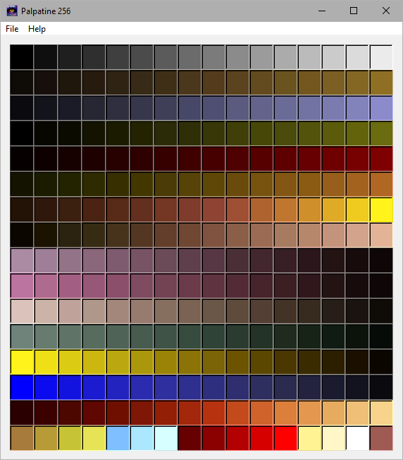

# Palpatine 256

Palpatine 256 supports the conversion of PNG, Microsoft Palette, Build Engine PALETTE.DAT,
JASC Palette, GIMP GPL, and Photoshop ACT palettes to 8-bit PNG, 
Microsoft Palette, JASC Palette, GIMP GPL, or Photoshop ACT,
while preserving the original index order of the source file.

You can create a source image in any graphics editor and save it
as a 16×16 PNG file for use with Palpatine 256.

## Importing a Palette
1. Go to File > Import File.
2. Choose the appropriate file extension to load as a source palette.

## Exporting a Palette
1. Go to File > Export File.
2. Select the desired file extension to save the palette in.

## Example
If you have a PNG palette file named my_palette.png (16×16), choose 
PNG as the extension when importing. To convert it into a GIMP .gpl 
file, select File > Export File and choose GIMP .gpl.

